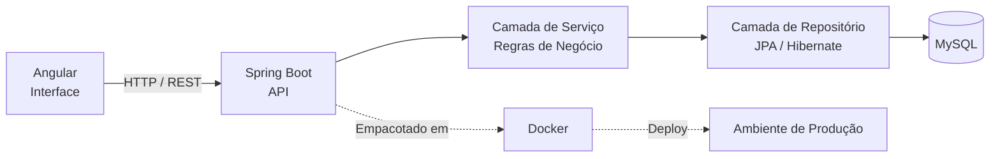

# `Levi Soares`

### Estudante de Engenharia de Software — back-end Java 

 

## Perfil

Estudante de engenharia de software com conhecimento no desenvolvimento de aplicações web completas, da modelagem de dados à experiência de interface. Atuo com foco em arquitetura de software bem estruturada, código sustentável e entrega orientada a valor de negócio.

`Atuo com desenvolvimento back-end, com conhecimentos básicos de front-end para entender melhor a experiência final e entregar integrações mais eficientes. Tenho foco em criar APIs, integrar sistemas e estruturar serviços confiáveis, com soluções claras e fáceis de manter.`

 

## Stack Técnica

<table>
<tr>
<td valign="top" width="50%">

**Backend**

| Tecnologia | Aplicação |
|---|---|
| Java | Linguagem principal de desenvolvimento |
| Spring Boot | Construção de APIs REST e microsserviços |
| MySQL | Modelagem relacional e persistência de dados |
| Docker | Containerização e padronização de ambientes |

</td>
<td valign="top" width="50%">

**Frontend**

| Tecnologia | Aplicação |
|---|---|
| Angular | Desenvolvimento de SPAs escaláveis |
| TypeScript | Tipagem estática e manutenibilidade |
| JavaScript | Lógica de interface e integrações |
| HTML / CSS | Estruturação e estilização semântica |

</td>
</tr>
</table>

 

## Abordagem de Arquitetura

Fluxo típico adotado nos projetos em que atuo, da requisição do cliente à persistência dos dados:

 

## Princípios de Engenharia

Diretrizes que guiam minhas decisões técnicas no dia a dia:

- **Separação de responsabilidades** — camadas de controller, service e repository bem definidas, evitando acoplamento desnecessário.
- **Código testável** — cobertura de testes unitários e de integração como parte do ciclo de desenvolvimento, não como etapa opcional.
- **Consistência de ambiente** — uso de Docker para eliminar divergências entre desenvolvimento, homologação e produção.
- **API previsível** — contratos REST claros, versionados e documentados, pensando em quem consome antes de quem implementa.
- **Interface como extensão do backend** — componentes Angular desenhados para refletir o real estado dos dados, com tratamento explícito de erros e estados de carregamento.

 

## Projetos em Destaque

| Projeto | Descrição | Stack | Link |
|---|---|---|---|
| `Biblioteca` | `Gerenciamento de emprestimos e usuarios`| [https://github.com/soareslevi566-lgtm/biblioteca](#) |
| `Agendador de horarios` | `Sistema em java para realizar agendamentos de facil adaptação a outros projetos` | [https://github.com/soareslevi566-lgtm/Agendador-horarios](#) |
| `Task tarefas` | `Sistema para registrar tarefas e organiza-las` | [https://github.com/soareslevi566-lgtm/API-tarefas-Java](#) |

 

## Indicadores

 

## Contato

Aberto a oportunidades de colaboração, discussões técnicas e projetos que envolvam o desenvolvimento de  arquitetura escalavél.

 

Última atualização: 2026

