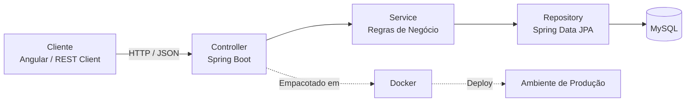

# `Levi Soares`

### Estudante de Engenharia de Software — Foco em Back-end Java

 

## Perfil

Estudante de engenharia de software com atuação concentrada no desenvolvimento back-end. Trabalho na construção de APIs, integração de sistemas e estruturação de serviços confiáveis, com foco em soluções claras, testáveis e de fácil manutenção.

Possuo também conhecimento prático de front-end — Angular, TypeScript e JavaScript — o que me permite entender a experiência final da aplicação e entregar integrações mais eficientes entre as duas pontas do sistema.

 

## Stack Técnica

<table>
<tr>
<td valign="top" width="58%">

**Backend — foco principal**

| Tecnologia | Aplicação |
|---|---|
| Java | Linguagem principal de desenvolvimento |
| Spring Boot | Construção de APIs REST e microsserviços |
| Spring Data JPA / Hibernate | Persistência e mapeamento objeto-relacional |
| MySQL | Modelagem relacional e armazenamento de dados |
| Docker | Containerização e padronização de ambientes |
| Maven | Gerenciamento de dependências e build |
| JUnit | Testes unitários e de integração |

</td>
<td valign="top" width="42%">

**Frontend — conhecimento complementar**

| Tecnologia | Aplicação |
|---|---|
| Angular | Consumo de APIs e construção de SPAs |
| TypeScript | Tipagem estática em componentes |
| JavaScript | Lógica de interface |
| HTML / CSS | Estruturação e estilização |

</td>
</tr>
</table>

 

## Abordagem de Arquitetura

Fluxo típico adotado nos projetos back-end, da requisição até a persistência dos dados:

 

## Princípios de Engenharia

Diretrizes que guiam minhas decisões técnicas, especialmente no desenvolvimento de serviços back-end:

- **Separação de responsabilidades** — camadas de controller, service e repository bem definidas, evitando acoplamento desnecessário.
- **Código testável** — cobertura de testes unitários e de integração como parte do ciclo de desenvolvimento, não como etapa opcional.
- **Consistência de ambiente** — uso de Docker para eliminar divergências entre desenvolvimento, homologação e produção.
- **API previsível** — contratos REST claros e consistentes, pensando em quem consome antes de quem implementa.
- **Integração ponta a ponta** — conhecimento de front-end usado para validar que os dados entregues pela API atendem de fato à necessidade da interface.

 

## Projetos em Destaque

| Projeto | Descrição | Stack | Link |
|---|---|---|---|
| Biblioteca | Gerenciamento de empréstimos e usuários | Java · Spring Boot · MySQL | [Repositório](https://github.com/soareslevi566-lgtm/biblioteca) |
| Agendador de Horários | Sistema em Java para agendamentos, com fácil adaptação a outros projetos | Java · Spring Boot | [Repositório](https://github.com/soareslevi566-lgtm/Agendador-horarios) |
| API de Tarefas | Sistema para registrar e organizar tarefas | Java · Spring Boot · REST API | [Repositório](https://github.com/soareslevi566-lgtm/API-tarefas-Java) |

 

## Indicadores

 

## Contato

Aberto a oportunidades de colaboração, discussões técnicas e projetos que envolvam desenvolvimento back-end e arquitetura de APIs escaláveis.

 

Última atualização: 2026

